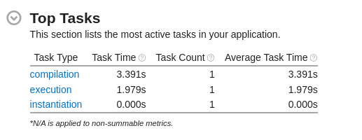
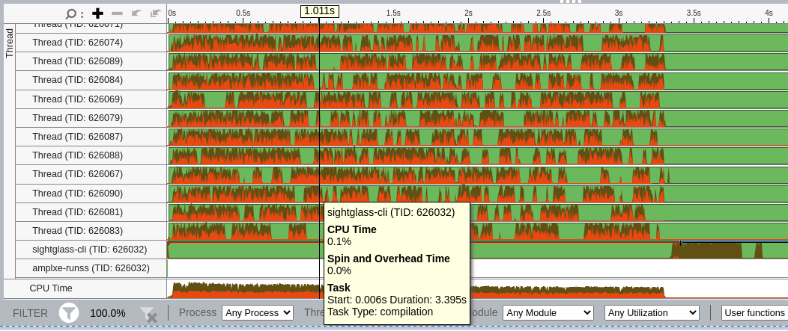
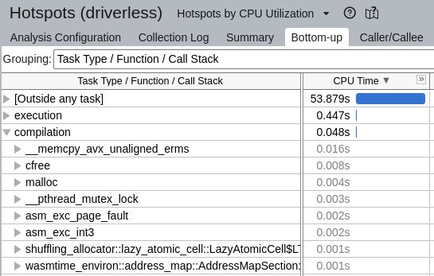
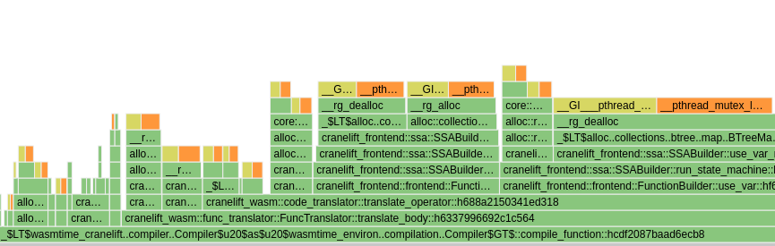

# Using VTune with Sightglass

Sightglass is instrumented to record each benchmark phase (compilation, instantiation, execution) as
a VTune task. This uses the [`ittapi`](https://crates.io/crates/ittapi) crate as a part of the
_measure_ configuration, e.g., `--measure vtune` (see
[`vtune.rs`](crates/recorder/src/measure/vtune.rs)).

### Run a benchmark in VTune

To run a benchmark using the VTune CLI, run:

```console
$ vtune -collect hotspots \
    target/release/sightglass-cli benchmark \
    --engine engines/wasmtime/libengine.so \
    --measure vtune
    -- benchmarks/spidermonkey/benchmark.wasm
```

This will create a new directory (e.g., `r000hs`) containing the results. Note that the same results
can be collected from within the VTune UI. For documentation on the available VTune configuration
options, see the [VTune User
Guide](https://www.intel.com/content/www/us/en/develop/documentation/vtune-help/top.html).

### Analyze the results

The `vtune` CLI application does have a way to display the results (e.g., `vtune -report hotspots
r000hs`) but the UI has the visualization tools &emdash; timelines, tables, filters &emdash; one
might expect for performance analysis. Import the results into the VTune UI by navigating to "Import
Result" and entering the results path (e.g., `.../r000hs`); alternately, simply run the same
analysis as above in the UI directly.



Notice that each phase is displayed on the timeline as a VTune task (see the thin blue bar above
`sightglass-cli`):



Also, work can be organized by task but note that (currently) the tasks only contain measurements
for the Sightglass thread, not any additional threads spawned by the engine during compilation(i.e.,
"Outside any task"):



To see flame graphs and explore call stacks, re-collect results with "Collect stacks" enabled:



### Helpful hints

- Try restricting which CPU cores are used with a tool like `taskset`: e.g., `taskset --cpu-list 0`
- Ensure the benchmark is not context-switched to another core using the Sightglass `--pin` flag
- You may want to analyze a single iteration; use `--processes 1 --iterations-per-process 1`
- When collecting call stacks, there is a balance between accuracy and slowing the workload down; on
  Linux, `-knob enable-stack-collection=true -knob stack-size=2048 -knob stack-type=software_lbr`
  seemed to work well but [this
  document](https://www.intel.com/content/www/us/en/develop/documentation/vtune-cookbook/top/configuration-recipes/profiling-hardware-without-sampling-drivers.html)
  has more details
